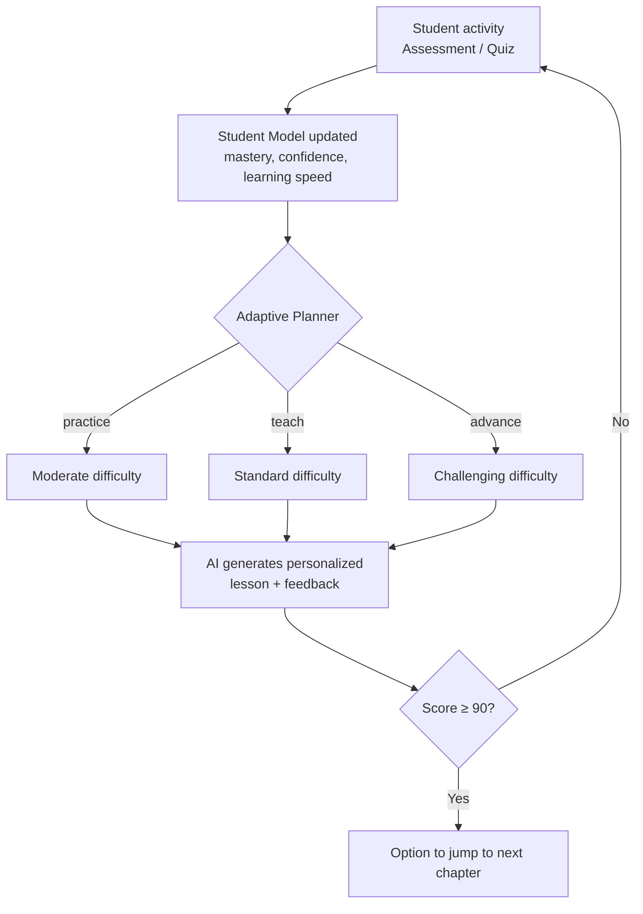

<div align="center">

# Adaptive AI Tutor

### Misinformation Literacy

*An intelligent adaptive learning system that personalizes instruction using a measurable student model.*


</div>

---

## About

Adaptive AI Tutor is **not just a chatbot**. It tracks how each student is learning (mastery, confidence and learning speed), then decides what they should do next: practice, learn, or move ahead. Lessons, quizzes and feedback are generated by AI and adjusted to each student's level.

---

## Core Adaptive Loop



---

## Features

### Core Features

| Feature | Status |
|---|:---:|
| User registration and login (JWT) | ✅ |
| Adaptive AI lesson generation | ✅ |
| Quiz generation and automatic grading | ✅ |
| Per-question answer explanations | ✅ |
| Learning progress dashboard | ✅ |
| Visual progress bars and score trend | ✅ |
| Adaptive difficulty | ✅ |
| Learning path based on performance | ✅ |
| Confidence tracking | ✅ |
| Personalized feedback | ✅ |
| Admin / Teacher dashboard | ✅ |
| Forced pre-test before the dashboard | ✅ |
| Next Chapter unlock (score ≥ 90) | ✅ |

### Thesis Standout Features

| Feature | Status |
|---|:---:|
| AI Chat Tutor (course-grounded) | ✅ |
| Misinformation detection exercises | ✅ |
| Daily study goals | ✅ |
| Spaced repetition review list | ✅ |
| Pre-test / Post-test evaluation | ✅ |
| CSV export of results | ✅ |
| Citation of course sources in chat | ✅ |
| Explanation of why answers are correct or incorrect | ✅ |
| Domain-whitelisted email validation | ✅ |

### Intentionally Not Included

| Feature | Reason |
|---|---|
| Full PDF upload and vector RAG | Adds heavy dependencies. The current chat is grounded in seeded course content. |
| Social media monitoring | Outside thesis scope. This is an educational tutor, not a detection platform. |

---

##  Tech Stack

| Layer | Technologies |
|---|---|
| **Backend** | FastAPI, SQLAlchemy (async), SQLite, JWT, Resend |
| **Frontend** | React 18, React Router, Axios, react-markdown |
| **AI** | OpenRouter (configurable free model) |

---

##  Quick Start

### 1. Backend

```bash
cd backend
python -m venv .venv
source .venv/bin/activate          # Windows: .venv\Scripts\activate
pip install -r requirements.txt
cp .env.example .env               # add your API keys
python -m uvicorn app.main:app --reload
```

### 2. Frontend (new terminal)

```bash
cd frontend
npm install
npm start
```

### 3. Open the app

| Service | URL |
|---|---|
| Frontend | http://localhost:3000 |
| API Docs | http://127.0.0.1:8000/docs |

---

## Pages

| Route | Purpose |
|---|---|
| `/dashboard` | Stats, daily goal, recommended action, spaced review and the **Next Chapter** button |
| `/lesson/:id` | Personalized AI lesson, quiz and explanations |
| `/chat` | AI Chat Tutor |
| `/exercises` | Interactive misinformation detection practice |
| `/progress` | History, score charts and mastery bars |
| `/evaluation` | Pre-test / Post-test and CSV export |
| `/admin` | Teacher view of all students |

---

##  Adaptive Policy

The planner uses only **three actions**. Rules are checked **from top to bottom, and the first match wins**.

| # | Condition | Action | Difficulty |
|:---:|---|---|---|
| 1 | `recent_score ≥ 90` | `advance` | challenging |
| 2 | `mastery < 55` **or** `recent_score < 70` | `practice` | moderate |
| 3 | `mastery ≥ 85` **and** (`recent_score ≥ 80` or no score yet) | `advance` | challenging |
| 4 | Everything else | `teach` | standard |

**Special behaviours**

- When the action is `advance` **and** a next chapter exists, the dashboard shows a **"Go to Next Chapter →"** button.
- Students who have never taken the pre-test are automatically redirected to `/evaluation`.

---

## Thesis Evaluation Flow

1. The student is **required** to take the pre-test.
2. They use adaptive lessons, quizzes and detection exercises.
3. A score of 90 or more unlocks the option to jump to the next chapter.
4. They take the post-test.
5. Compare the scores and export the results as CSV.
6. The teacher dashboard shows the progress of all students.

---

## License

For academic use only.

---

<div align="center">

Made by **israt_obviously** · WUB · 2026

</div>
